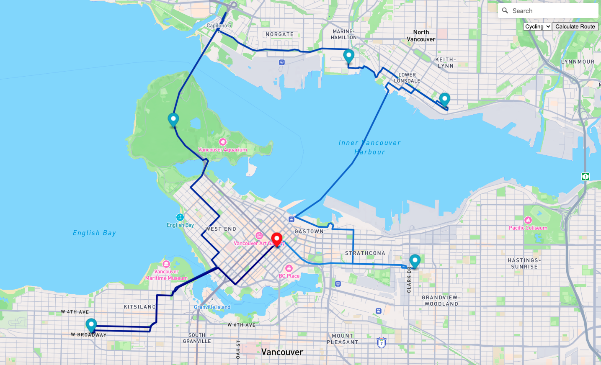

# Husky Planner

## Introduction
Husky Planner is an application inspired by the functionality of travel itinerary apps like Wanderlog, designed to help users plan their visits to multiple locations efficiently. Developed with the support and suggestions from Professor Ryan Rad, this project builds upon the concepts from Edmond's previous project, focusing on solving the Traveling Salesman Problem (TSP) – an NP-hard problem in combinatorial optimization.

## Features
- **Mapbox API Integration**: Utilizes the Mapbox Directions Matrix API to fetch distances between multiple points and the Mapbox Directions API to draw routes on the map.
- **Optimized Path Calculation**: Implements the Held-Karp dynamic programming algorithm to find the shortest path that visits each user-selected destination exactly once and returns to the starting point.
- **Interactive Map Interface**: Allows users to click on the map or search to add up to five destinations to their travel plan.
- **Customizable Itinerary**: Users can create a personalized travel route with just a few clicks.

## Usage
1. **Setting Up**: Clone the repository and navigate to the project directory.
2. **Go to Folder**: Go to `./mapbox_version`
3. **Configuration**: In `config.js`, replace the placeholder text with your own Mapbox API key to enable the Mapbox services.
4. **Running the App**: Open the `index.html` file in a web browser to start using the app.
5. **Adding Destinations**: Use the search bar or click on the map to select the destinations you want to visit.
6. **Choose Traveling Method**: Use the select box to choose which traveling method(Cycling/Walking/Driving) you will be using, default is cycling.
7. **Generating the Route**: Once you have selected your destinations, click the 'Calculate Route' button to view the optimized path. **light blue indicating start, dark blue indicating end!!!**

## Local Development
For local development, make sure you have the following installed:
- A modern web browser.
- A text editor or IDE of your choice.

## Developers & Credits
This application was developed as a collaborative effort by Group10 (Xiaolai Chen@SeanXLChen Pavan Kumar Reddy Sajjala@Pavinc and Yu Ji@phantom23333) with insights from Professor Ryan Rad.

## Note
Husky Planner is a tool for educational and demonstration purposes and uses the Mapbox API under its terms of service.

## Feedback and Contributions
We welcome your feedback and contributions to the Husky Planner project. Please feel free to open an issue or pull request on the repository.

Enjoy planning your journey with Husky Planner!